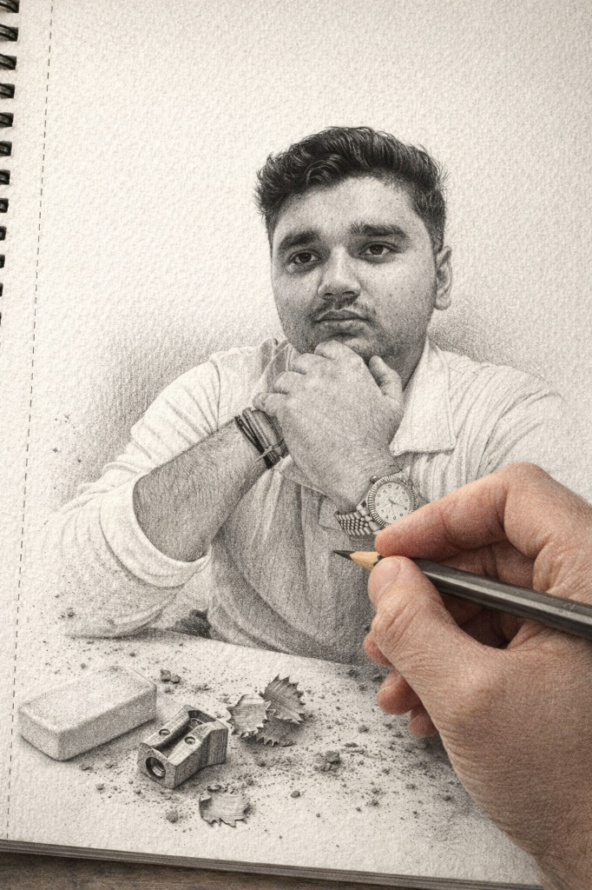

# 👨‍🚀 Vaibhav Tiwari | Portfolio v2.0

<div align="center">
  
  
  <h3>Full Stack Developer | UI/UX Enthusiast | Creative Thinker</h3>

[](https://vaibhav-portfolio-930c6.web.app)
[](LICENSE)
[]()

[**Explore Live Site »**](https://vaibhav-portfolio-930c6.web.app)

</div>

---

## 🌌 Overview

Welcome to my personal portfolio, reimagined with a **"Deep Space"** theme. This project is a showcase of my skills, projects, and professional journey, built with a focus on **performance**, **accessibility**, and **immersive user experience**.

The site features a custom-built starfield background, glassmorphism UI elements, and smooth page transitions—all achieving high Lighthouse scores.

## 🚀 Key Features

### 🎨 Immersive Design

- **Deep Space Theme:** A dark, cinematic aesthetic with animated starfields and planets.
- **Glassmorphism:** Modern, translucent UI components that float above the background.
- **Micro-Interactions:** Interactive hover states and scroll-reveal animations using `IntersectionObserver`.

### ⚡ Performance First

- **PWA Ready:** integrated `sw.js` Service Worker for offline access and instant loading.
- **Optimized Assets:** Preloaded critical resources, optimized fonts, and lazy-loading for images.
- **Responsive:** Fluid layout that adapts seamlessly from mobile devices to 4K screens.

## 🛠️ Tech Stack

<div align="center">
  
  
  
  
  
</div>

## 📂 Project Structure

```bash
portfolio/
├── 📄 index.html        # Landing page (Hero, Skills, Testimonials)
├── 📄 projects.html     # Detailed project case studies
├── 📄 about.html        # Professional timeline and bio
├── 📄 contact.html      # Contact form (Formspree)
├── 📄 404.html          # Custom "Lost in Space" error page
├── 🎨 style.css         # CSS Variables, Animations, Responsive Design
├── 📜 main.js           # Core logic, UI interactions, Starfield effect
├── ⚙️ sw.js             # Service Worker for caching & PWA
└── 📷 assets/           # Optimized images and icons
```

## 🏎️ Getting Started

Clone the repository and run it locally:

```bash
# Clone the repo
git clone https://github.com/vaibhav09012007-design/Vaibhav-Portfolio.git

# Navigate to portfolio directory
cd Vaibhav-Portfolio/portfolio

# Start a local server (e.g., using Python)
python -m http.server
# OR using Node.js static serve
npx serve .
```

## 📬 Contact

**Vaibhav Tiwari**

- 🌐 [Portfolio](https://vaibhav-portfolio-930c6.web.app)
- 🐙 [GitHub](https://github.com/vaibhav09012007-design)
- 💼 [LinkedIn](https://linkedin.com/in/vaibhav-tiwari)
- 📧 [Email](mailto:vaibhav09012007@gmail.com)

---

<div align="center">
  Made with ❤️ and a bit of Stardust ✨
</div>
